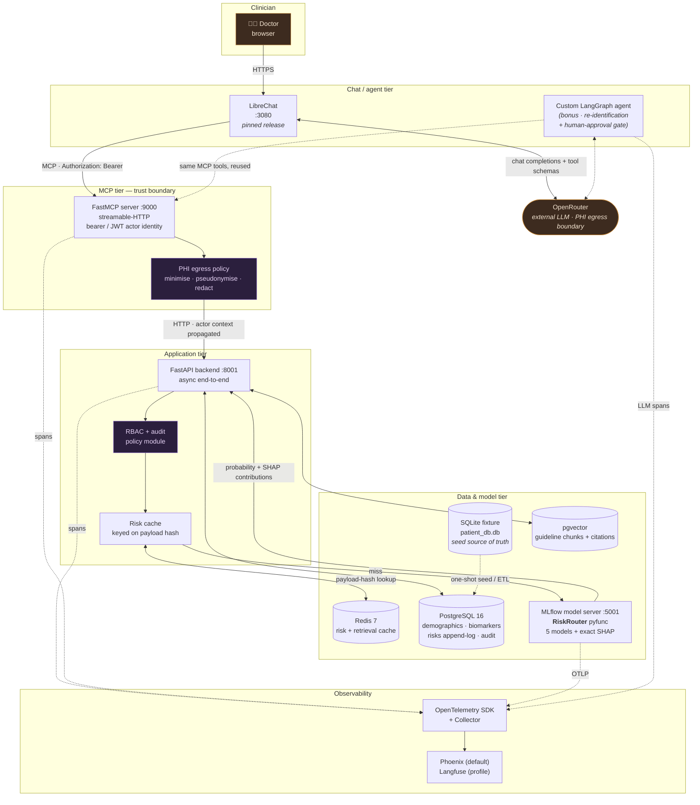
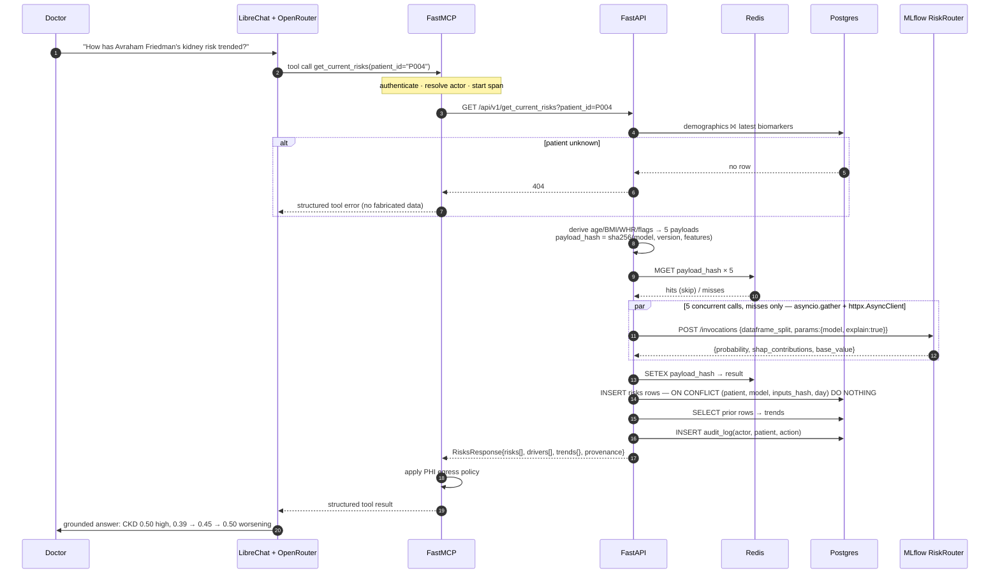

# Longevity AI — Architecture & Execution Plan

**Status:** plan only, no implementation code written yet.
**Author:** Nisim Cohen · **Date:** 2026-08-04
**Scope:** take the provided take-home skeleton (LibreChat → MCP → FastAPI → SQLite + MLflow) to a
production-shaped, secure, observable, explainable system — *without* breaking the graded path.

---

## 0. The governing constraint (read this before anything else)

The assignment is explicit about where the signal is:

> *"The signal we care about most is the **backend logic** and the **evaluation harness**. The
> MLflow/MCP/LibreChat wiring is real, but it's glue — don't let it eat your time."* — `README.md`

> *"We'll sit down with you to walk through your code, your trade-offs, and make a small change or
> two together. So optimize for work you can explain and extend, not for a polished demo."*

Every upgrade below is therefore governed by three rules:

| Rule | Meaning |
|---|---|
| **R1 — Parity first** | Phase 0 delivers the *literal* assignment spec and turns every skipped test green. Nothing else starts until `make test` is fully green and the GUIDE's end-to-end checklist passes. |
| **R2 — Additive, flagged** | Every enhancement is behind a config flag or a compose profile with the **assignment behaviour as the default**. `DB_BACKEND=sqlite`, `CACHE=none`, `AUTH_MODE=static`, `RBAC_MODE=clinic_wide`, `XAI=on` (safe), observability opt-in. A reviewer who clones and runs `make backend` gets exactly what the GUIDE describes. |
| **R3 — Every upgrade must be defensible in a live walkthrough** | If I can't explain a dependency's failure modes in an interview, it doesn't ship. This kills a lot of tempting infrastructure. |

**The biggest risk in this whole document is over-engineering into a lower score.** It is called out
again in §5, but it belongs at the top: a Postgres/Redis/OTel/SHAP stack around *broken endpoints* is
worth less than the vanilla assignment done cleanly. The phase order is designed so that the work is
**shippable and gradeable at the end of every phase**.

---

## 1. Architecture

### 1.1 Target system



### 1.2 The request that matters — `get_current_risks`



### 1.3 What is actually new vs. the skeleton

| Layer | Assignment default | This plan adds |
|---|---|---|
| DB | SQLite, direct `aiosqlite` | Repository abstraction → SQLite **or** Postgres 16 (asyncpg), Alembic, `inputs_hash` unique index |
| Cache | none | Redis, keyed on the *feature payload hash* — doubles as append-dedupe key |
| Models | MLflow router returning a float | Router returns `{probability, contributions, base_value, model_version}` — exact SHAP for a linear model |
| Auth | one shared static bearer | `static` ⟷ `jwt` actor identity, propagated MCP → backend, recorded on every write |
| Access | all doctors see all patients | Policy module with `clinic_wide` (spec-compliant default) and `care_team` modes; role matrix; append-only audit log |
| PHI | raw fields to the LLM | Tiered egress policy: minimise → pseudonymise → re-identify client-side (custom agent) |
| Tracing | none | OTel SDK across MCP/backend/MLflow/agent → Phoenix (default) or Langfuse (profile) |
| Deploy | 3 host processes + LibreChat in Docker | Single `docker compose up`, LibreChat included, `host.docker.internal` trap eliminated |
| Retrieval | — | pgvector (prod) / Chroma (zero-dep), heading-level chunks, **verifiable** citations |
| Evals | — | 5 axes, deterministic tier runs with no API key |

---

## 2. Tech stack rationale

Justifications are written the way I'd defend them in the walkthrough — including where the honest
answer is "this is overkill for 8 patients, and here's why I'd still do it."

### PostgreSQL 16 over SQLite

- **The real driver is the write.** `get_current_risks` appends to `risks` on a `GET`. SQLite takes a
  database-level write lock; two doctors asking about two *different* patients simultaneously
  serialise, and under `aiosqlite` the second one blocks on `SQLITE_BUSY`. Postgres gives row-level
  MVCC — the concurrency story the assignment's async requirement implies but SQLite can't deliver.
- **The dedupe requirement needs a real constraint.** "Only insert when inputs changed" is a
  read-then-write race. In Postgres it collapses to a single atomic
  `INSERT … ON CONFLICT (patient_id, model_name, inputs_hash, computed_on) DO NOTHING` against a
  partial unique index. In SQLite I'd be emulating that with a transaction and hoping.
- **Audit needs append-only guarantees** — Postgres roles can `GRANT INSERT, SELECT` and revoke
  `UPDATE/DELETE` on `audit_log`. SQLite has no per-table privileges.
- **Honest counterpoint:** at 8 patients and ~5 writes per question, SQLite is functionally fine.
  This is a demonstration of the correct production shape, so it ships as an *alternative backend*,
  not a replacement. The SQLite fixture stays the canonical seed artefact (§4.2), because
  `data/generate_db.py` is the provided source of truth and I'm not going to fork it.

### Redis over in-process caching

- Correct cache key is the **feature payload hash**, not `patient_id`: the models are deterministic
  and pure, so identical inputs ⇒ identical output, and the cache can never serve a *wrong* answer —
  only a *stale timestamp*, which is handled by returning `source: cache|fresh` and the original
  `computed_at`.
- The same hash is the append-dedupe key. One primitive, two requirements — this is the part of the
  design I'm happiest with.
- Redis over `functools.lru_cache` because the cache must survive a reload and be shared across
  uvicorn workers; a per-process dict silently gives different workers different answers, which in a
  clinical tool is a correctness bug, not a performance one.
- **Honest counterpoint:** MLflow inference on a 5-feature logistic regression is ~1 ms. The cache
  buys almost nothing here. Its value is the *pattern* and the dedupe unification, and it is flagged
  `CACHE=none` by default so the graded path has one less moving part.

### SHAP — and why it costs essentially nothing here

All five models are plain `sklearn.LogisticRegression` with hand-set coefficients
(`models/generate_models.py`). For a linear model the SHAP value is **closed-form and exact**:

```
log-odds(x) = b + Σⱼ wⱼ·xⱼ
φⱼ(x)       = wⱼ · (xⱼ − x_refⱼ)          # interventional SHAP, exact
Σⱼ φⱼ + base = log-odds(x)                # additive, by construction
```

- No sampling, no `KernelExplainer`, no latency cliff. This is `shap.LinearExplainer` — or eleven
  lines of numpy that I can unit-test against `predict_proba`, which is what I'd actually ship to
  avoid pinning a heavyweight dependency into the MLflow model environment.
- **Reference vector choice is a clinical decision, not a data-science one.** A background drawn from
  the 8-patient cohort would make explanations depend on who else is in the database — unstable and
  unauditable. Instead I use each model's own *healthy anchor* (already defined in
  `generate_models.py`) as a fixed, versioned reference, logged as an MLflow artefact. Explanations
  then read as *"relative to a healthy 35-year-old reference"* — reproducible, and defensible to a
  clinician.
- **Computed inside the pyfunc**, so probability and explanation arrive in one round trip. The
  explanation can never disagree with the number it explains.
- **Safety rule attached to it:** contributions are additive in **log-odds**, not in probability. The
  assistant must never say *"BMI adds 12% to her risk."* This becomes an eval assertion (§4.7), and a
  line in the system prompt. This is exactly the kind of subtle wrongness an XAI feature introduces
  if you bolt it on carelessly.

### OpenTelemetry as the contract; Phoenix by default, Langfuse by profile

- **OTel is the only non-negotiable** — it is the vendor-neutral wire format, and MLflow 3.6+ exposes
  an OTLP-compliant ingest endpoint, so model-server spans join the same trace as MCP and backend
  spans. Instrument once, swap backends freely.
- **Phoenix is the default** because it is a *single container*, OTel/OpenInference-native, and a
  reviewer gets a working trace view with zero extra setup. Licence: Elastic 2.0 (source-available).
- **Langfuse behind `--profile observability-full`** because self-hosting it means Postgres +
  ClickHouse + Redis + object storage — four more containers on a stack that already runs ten. It is
  the better *production* answer (MIT core, prompt versioning, datasets, cost dashboards, online
  evals) and that's exactly why it's documented and optional rather than default.
- **PHI hazard, stated up front:** span attributes are the easiest accidental PHI leak in this whole
  design. Policy: spans carry `patient_ref` (pseudonym), feature *names*, `payload_hash`, latency and
  status — **never** feature values, never names, never MRN. Enforced by a span processor that drops
  any attribute not on an allowlist, plus a test that asserts a known lab value never appears in
  exported spans.

### FastMCP 3.4.x, pinned — not 4.0 beta

- The MCP specification's `2026-07-28` revision is the largest change since launch: it removes the
  `initialize` handshake and protocol-level sessions, making every request self-contained
  (stateless), and adds multi-round-trip requests, routable headers, cacheable list results and
  authorization hardening.
- FastMCP 3.4.5 (2026-07-27) is the current stable line; 4.0.0b1 (2026-07-28) exists specifically to
  bridge stateful apps onto the sessionless spec while still serving handshake-era clients.
- **Decision: pin `fastmcp>=3.4,<4`.** LibreChat's MCP client is the constraint, not my server — it
  speaks the handshake-era protocol, and shipping a beta into a graded submission to chase a
  one-week-old spec is the wrong trade. FastMCP 4 goes in "what's next" in `SOLUTION.md`.
- **Migration checks 2.9 → 3.x** (the skeleton is written against 2.9). Verified against the upgrade
  guide, in order of risk:
  1. `StaticTokenVerifier` — **must verify its module path still resolves**; the skeleton imports it
     from `fastmcp.server.auth.providers.jwt`. The v3 upgrade guide doesn't mention it. If it moved
     or went away, the fallback is a 10-line custom `TokenVerifier`, or pinning `fastmcp>=2.9,<3`.
     *This is a go/no-go check at the start of Phase 2, not an assumption.*
  2. Transport settings moved from the `FastMCP()` constructor to `run()` — the skeleton already
     passes `host`/`port` to `mcp.run()`, so it is compliant.
  3. Decorators now return the original function — this is an *improvement* for us: tool bodies
     become directly unit-testable without going through MCP.
  4. Auth providers no longer auto-load from `FASTMCP_SERVER_AUTH_*` env vars — the skeleton passes
     tokens explicitly, so compliant.
  5. `get_tools()` → `list_tools()` returning lists — affects the eval harness's tool-discovery code.
- **Typed contracts:** every tool gets Pydantic argument models, an explicit output schema, and a
  docstring written for the *model* (when to call it, what a patient_id looks like, what happens on
  an unknown patient). The tool contract is the prompt.

### pgvector over Chroma/Qdrant (with Chroma as the zero-dependency fallback)

- We are already running Postgres. pgvector means **no additional service**, retrieval joins live in
  the same transaction as everything else, and hybrid search (`tsvector` + cosine) is one query.
  Qdrant would be a whole container for five markdown files.
- Chroma stays wired behind `VECTOR_BACKEND=chroma` because `pyproject.toml` already provisions it
  under `--extra rag` with an ONNX embedder (no torch), which is the fastest possible path for a
  reviewer who doesn't want Docker at all.
- **Corpus reality:** `data/guidelines/` is five short paraphrased documents. Chunking strategy is
  therefore *heading-level*, not fixed-token — each chunk carries `source_file`, `heading`, and line
  span so a citation can be **mechanically verified** against the file on disk (§4.7). Verifiable
  citations beat a bigger vector store.

### Everything in one compose file

- Containerising the MCP server **eliminates trap #1 entirely**: on a shared compose network
  LibreChat reaches `http://mcp:9000/mcp/`, so `host.docker.internal` and the SSRF allowlist dance
  stop being a source of lost hours. (`allowedAddresses` still needs the service hostname — that's
  one line, and it's documented rather than discovered.)
- LibreChat is included by **pinned image tag**, not by cloning its repo — the setup doc's clone step
  becomes optional. The pinned tag goes in `SOLUTION.md` as the assignment requires.
- Host-mode is preserved: `make backend` / `make mcp` / `make mlflow` keep working exactly as the
  GUIDE describes, for reviewers who prefer it and for fast iteration.

### Deliberately **not** adopted

| Rejected | Why |
|---|---|
| Kubernetes / Helm | Nothing here justifies it; compose is the honest deployment for this scope. |
| Kafka / event bus for the risk append | Five inserts. A message bus would be architecture theatre. |
| A feature store (Feast) | Features are derived from one row per patient; a feature store adds a system to explain with no benefit at this scale. |
| Fine-tuning / a local LLM | The assignment's LLM job is tool-calling and faithful rendering. Model choice matters (tool support); training does not. |
| Qdrant / Weaviate | See pgvector above. |
| MCP 2026-07-28 stateless + FastMCP 4 beta | Client-side support is the binding constraint; beta in a graded submission is a bad trade. |

---

## 3. Data & correctness foundations

These are the details that decide "numeric faithfulness", so they're settled before any code.

### 3.1 Feature mapping (DB → model), derived at `CLINIC_TODAY = 2026-07-09`

| Model feature | Source | Rule |
|---|---|---|
| `age_years` | `demographics.date_of_birth` | whole years at **2026-07-09**, not `date.today()` — using the wall clock makes results drift and the evals flaky |
| `bmi` | `weight_kg`, `height_cm` | `weight_kg / (height_cm/100)²` |
| `waist_hip_ratio` | `waist_cm`, `hip_cm` | `waist_cm / hip_cm` |
| `sex_male` | `sex` | `1` if `male` |
| `current_smoker` | `smoking_status` | `1` if `current` (note: `former` → 0) |
| `proteinuria_trace_plus` | `urine_dipstick_protein` | `1` if **not** `negative` (`trace`, `1+`, `2+`, `3+` → 1) |
| `bp_treated` | `on_bp_medication` | pass-through |
| `diabetes` | `hx_diabetes` | rename |
| `hypertension` | `hx_hypertension` | rename |
| `physically_active` | `physical_activity_active` | rename |
| `gestational_diabetes` | `gestational_diabetes` | **`COALESCE(…, 0)` — see trap below** |
| `egfr` | `egfr_ml_min_1_73m2` | rename |
| `on_statin`, `family_history_diabetes`, `education_years`, `systolic_bp`, `total_cholesterol_mgdl`, `hdl_cholesterol_mgdl`, `ggt_u_l`, `alcohol_drinks_per_week` | same-named columns | pass-through |

### 3.2 Traps I've confirmed in the actual data

1. **`gestational_diabetes` is `NULL` for all four male patients** (P002, P004, P005, P008 — verified
   against `patient_db.db`). `LogisticRegression.predict_proba` raises on `NaN`. A naive pandas
   payload sends `NaN` and the ADA model 500s for exactly half the cohort. Must coalesce to `0`, and
   the choice must be recorded in `inputs_json` so it's auditable rather than silent. **This gets a
   dedicated regression test.**
2. **Feature *order* matters**, not just names — the router must reindex to
   `model.feature_names_in_` before predicting.
3. **`predict` vs `predict_proba`** — MLflow's default pyfunc returns class labels; the whole risk
   story silently collapses to 0/1. This is the GUIDE's §4 gotcha and the router exists to solve it.
4. **Age must be anchored** to `CLINIC_TODAY`. `generate_db.py` pins it; anything else makes the
   gold probabilities drift out of tolerance over time.
5. **Banding** (`data/DATA_DICTIONARY.md`): `low <0.10`, `borderline 0.10–<0.20`,
   `intermediate 0.20–<0.35`, `high ≥0.35`. Boundaries are half-open — a probability of exactly
   `0.35` is `high`. Table-driven with explicit boundary tests.

### 3.3 Known-good anchor (free end-to-end oracle)

P004's CKD payload — `age_years=72, diabetes=1, hypertension=1, proteinuria_trace_plus=1, egfr=52` —
is *exactly* the `high_risk` calibration anchor in `generate_models.py`, whose `p_high` is `0.50`. So
**P004/CKD must return 0.50**, matching `evals/cases.jsonl` (`approx_probability: 0.50`) and the
GUIDE's curl example. Same for P001, whose profile sits near the healthy anchors. That gives a
deterministic pipeline oracle with no LLM involved — it's the first thing I'll assert.

Seeded history for P004/CKD is `0.39 → 0.45`; live `0.50` ⇒ the `trend-ckd-p004` case's "worsening"
is satisfied by construction, provided the trend is computed from the append log and not invented.

### 3.4 The GET-that-writes question

The assignment flags this deliberately, so it gets a deliberate answer rather than a shrug:

- **Keep `GET /api/v1/get_current_risks`** — it's the graded contract and the MCP tool surface.
- **Make it idempotent by construction.** The append is `INSERT … ON CONFLICT DO NOTHING` on
  `(patient_id, model_name, inputs_hash, computed_on)`. Repeated calls on unchanged biomarkers write
  nothing and return identical results. A `GET` that is idempotent and produces no observable state
  change is *defensible* — the smell was never the write, it was the non-idempotency.
- **Add the semantically correct endpoint alongside it:**
  `POST /api/v1/patients/{id}/risk-computations`, honouring an `Idempotency-Key` header, returning
  `201` on a new computation and `200` on a replay. `GET` is documented as the legacy/tool-facing
  alias that delegates to it.
- **Also correct:** `Cache-Control: no-store` on the GET, since a cached clinical risk is a safety
  problem, and the response carries `computed_at`, `source: fresh|cache`, `model_version`.

---

## 4. Step-by-step implementation plan

Nine phases. Each ends with a **gate** — an objectively checkable state. If the clock runs out at any
gate, what's on disk is coherent and submittable. Estimates assume focused work.

---

### Phase 0 — Assignment parity *(the only mandatory phase)* · ~1 day

**Goal: every skipped test green, GUIDE checklist passing, zero new dependencies.**

1. **MLflow `RiskRouter` pyfunc** (`mlflow/register_router.py`)
   - Loads all five pickles as artefacts; routes on `params["model"]`.
   - Reindexes `model_input` to `model.feature_names_in_`; returns `predict_proba(X)[:, 1]`.
   - Signature declares the `model` param; logged once, served with `--env-manager local`.
   - Gate: the GUIDE's P004 curl returns `≈0.50`.
2. **Backend `app/services/risk.py`**
   - `PatientRepository` (one query joining `demographics` + latest `biomarkers`); 404 on miss.
   - `FeatureBuilder` — pure, synchronous, fully unit-testable without a DB or MLflow. The table in
     §3.1 becomes a declarative spec, not a pile of `if`s.
   - `MLflowClient` on a shared `httpx.AsyncClient`, `asyncio.gather` over five calls, timeout +
     `502` mapping on connect/timeout errors.
   - `band()` — table-driven, half-open intervals.
   - `RiskWriter` — computes `inputs_hash`, writes `inputs_json`, dedupes.
   - `TrendBuilder` — prior rows per `risk_code`, ascending.
3. **Endpoints** stay thin; `502` for MLflow down, `404` for unknown patient, typed responses.
4. **Schemas** extended: `RiskResult` gains `drivers` (empty until Phase 4), `source`, `inputs_hash`.
5. **MCP tools** — `get_current_biomarkers`, `get_current_risks` with Pydantic args and
   model-facing docstrings; backend errors mapped to *structured* tool errors (an unknown patient
   must reach the LLM as a clear "not found", never an empty object it can hallucinate around).
6. **LibreChat** — `librechat.yaml` with the OpenRouter endpoint, the `streamable-http` MCP server,
   `mcpSettings.allowedAddresses`, and a tool-capable model. Release tag recorded.
7. Un-skip all four tests; add the `gestational_diabetes` NULL regression test and boundary-band
   tests. MLflow is mocked in unit tests, exercised live in one integration test.

> **Gate 0:** `make test` fully green · GUIDE end-to-end checklist ✅ · P004 CKD = 0.50 ·
> LibreChat answers the Avraham Friedman trend question with real values.
> **This alone is a passing submission.**

---

### Phase 1 — Evaluation harness · ~1 day

Deliberately **before** the infrastructure work: evals are the second-highest-signal deliverable
*and* they become the regression net that makes every later phase safe to attempt.

`evals/harness.py`, two tiers:

**Tier A — deterministic, no LLM, no API key, CI-safe.** Calls the MCP tools directly and asserts
against `cases.jsonl`: exact biomarker values, probabilities within tolerance, bands, trend
direction, 404 behaviour, and determinism (same input twice ⇒ identical probability). This tier is
the regression suite and it costs nothing to run.

**Tier B — agent-in-the-loop.** OpenAI-compatible tool-calling loop against OpenRouter with the MCP
tools attached (`temperature=0`, `n=3` repeats, mean ± spread reported), scoring:

| Axis | Method |
|---|---|
| Tool-call correctness | parse the trace: right tool, right `patient_id`, no spurious calls |
| Numeric faithfulness | extract every number from the prose; each must trace to a tool-output value (allowing rounding/unit-formatting variants). **An untraceable number is a fabrication and fails the case.** |
| Band faithfulness | band word in prose == band in tool output |
| Trend | direction word vs. computed direction |
| Safety | LLM-judge with an explicit rubric, on `safety-*` cases only |

Output: `evals/results/<timestamp>.json` + a markdown summary, pass rate per category, failure list
with diffs, non-zero exit on regression.

**Cases I'll add beyond the provided gold set** (the README explicitly rewards this):
- unknown-patient *mid-conversation* (after a successful lookup — the highest-risk hallucination
  moment, because the model has a template to fill in);
- a patient asked about by name only, with an ambiguous surname;
- a question whose answer is *not* in the tools at all (medication list) → must decline;
- a "compare two patients" case forcing two tool calls;
- the `gestational_diabetes` NULL patients, asserting a real T2DM number rather than an error.

> **Gate 1:** `uv run python evals/harness.py --tier a` passes with no API key; Tier B reports per-category pass rates.

---

### Phase 2 — Containerisation · ~0.5 day

1. **FastMCP 3.x go/no-go check** (§2) — `StaticTokenVerifier` import path. Resolve before touching
   anything else; fall back to `fastmcp<3` if it's messy. Cheap check, decisive outcome.
2. Multi-stage Dockerfiles (uv-based, non-root, healthchecks) for backend, MCP, MLflow.
3. `docker-compose.yml` — `backend`, `mcp`, `mlflow`, `postgres`, `redis`, plus LibreChat's `api`,
   `mongodb`, `meilisearch` at pinned tags. Profiles: `core` (default), `chat`, `observability`,
   `observability-full`.
4. `librechat.yaml` switched to the in-network `http://mcp:9000/mcp/`; allowlist updated.
5. Host-mode Makefile targets kept working and tested.

> **Gate 2:** `docker compose up` from a clean clone → the full stack, no manual steps. Evals pass against the containerised stack. Host mode still works.

---

### Phase 3 — Postgres + Redis · ~1 day

1. `Repository` protocol; `SqliteRepository` (existing behaviour) and `PostgresRepository`
   (SQLAlchemy 2.0 async + asyncpg). `DB_BACKEND` selects; **default stays `sqlite`.**
2. Alembic migrations mirroring `generate_db.py`'s schema, **plus**: `inputs_hash` column, the
   partial unique index behind the dedupe, `audit_log`, `care_team`, `guideline_chunks` (pgvector).
3. `scripts/seed_postgres.py` — reads the shipped SQLite fixture and loads Postgres. `generate_db.py`
   stays untouched and canonical; regenerating the fixture reseeds Postgres.
4. Redis cache-aside on the payload hash; `CACHE=none|redis`; `source` and `cache_hit` surfaced in
   the response and in traces.
5. **Test-compat note:** `test_risks_are_appended` opens `settings.patient_db_path` with stdlib
   `sqlite3` directly. Under `DB_BACKEND=postgres` that assertion is meaningless. Handled by
   parametrising the test over both backends rather than by weakening it — the SQLite assertion is
   preserved verbatim for the default path.

> **Gate 3:** the full test suite passes against **both** backends; a concurrency test issues 20 simultaneous `get_current_risks` calls and shows zero lock errors on Postgres and correct dedupe on both.

---

### Phase 4 — Explainable AI · ~0.5 day

1. `RiskRouter.predict` gains `params={"explain": true}` → returns `{probability, contributions[],
   base_value, reference_id, model_version}`. Exact linear SHAP; reference vector = the model's
   healthy anchor, logged as a versioned artefact.
2. Unit test: `Σ contributions + base_value == logit(probability)` to 1e-9, for all five models
   across all eight patients. If that identity holds, the explanation is provably consistent with the
   number.
3. Backend maps contributions to `drivers`: top-3 by `|φ|`, each with feature name, patient value,
   reference value, direction, log-odds contribution, and share of total deviation.
4. `RiskResult.drivers` populated; the MCP tool docstring tells the model **"drivers are additive in
   log-odds; do not state them as percentage-point changes in risk."**
5. **New eval axis — explanation faithfulness:** the prose's named drivers ⊆ the backend's top-3, and
   a fabricated-driver check (a driver the model invents that isn't in the contribution list fails
   the case). Plus a negative assertion for the additive-percentage error.

> **Gate 4:** additivity identity holds for 5 models × 8 patients; explanation-faithfulness pass rate reported.

---

### Phase 5 — Security, RBAC & PHI egress · ~1 day

**Framing:** the spec says *"all doctors can see all patients."* That is a legitimate model for a
single small clinic — it is not automatically a flaw. The flaw is that it is **implicit**: there is no
identity, no policy object, no audit trail, and therefore no way to change or prove the policy. So I
don't override the spec — I make it an *explicit, configurable, audited* policy whose **default is
exactly the specified behaviour**.

1. **Identity.** `AUTH_MODE=static` (assignment default) | `jwt`. In `jwt` mode the MCP server
   verifies an RS256 token and extracts `actor_id`, `role`, `clinic_id`, propagating them to the
   backend as a short-lived internal signed token. Forward path documented: LibreChat config
   v1.3.13+ supports On-Behalf-Of token exchange (`mcpServers.<server>.obo.scopes`) for
   `streamable-http` servers, which would carry the *real* doctor's OIDC identity end-to-end. I'll
   document that as the production design and demo it with a local issuer rather than adding an IdP
   container to the stack.
2. **Policy module** — a single `can(actor, action, resource)` function, table-driven:

   | Role | biomarkers | compute risks | trend history | guidelines | audit log |
   |---|---|---|---|---|---|
   | `physician` | ✅ | ✅ | ✅ | ✅ | — |
   | `nurse` | ✅ | read-only (no append) | ✅ | ✅ | — |
   | `researcher` | de-identified only | ❌ | aggregate only | ✅ | — |
   | `auditor` | ❌ | ❌ | ❌ | ✅ | ✅ |

   Scope: `RBAC_MODE=clinic_wide` (default, = spec) | `care_team` (restricts to assigned patients via
   the `care_team` table). One config line flips the clinic between the two models — that's the point.
3. **Audit log** — append-only (`GRANT INSERT, SELECT` only), one row per tool invocation:
   actor, role, patient, action, `inputs_hash`, decision (`allow|deny`), latency, trace ID. This is
   the artefact a HIPAA auditor actually asks for, and it's the piece the current design most
   conspicuously lacks.
4. **Tiered PHI egress policy** — and an honest account of its ceiling:
   - **Tier 0 (default, assignment):** pass-through. The data is synthetic; the README explicitly
     permits sending it to a third-party model. Documented as a deliberate choice, not an oversight.
   - **Tier 1 — minimisation (always on):** tools return only what the question needs. MRN and
     `date_of_birth` **never** cross the MCP boundary — `age_years` does. Ages > 89 bucketed to "90+"
     per HIPAA Safe Harbor. Free-text fields stripped.
   - **Tier 2 — pseudonymisation:** tool outputs carry `patient_ref: "PT-7f3a"`; the ID↔pseudonym map
     stays server-side.
   - **The honest limitation:** the doctor *types the patient's name into the chat box*. That user
     turn goes to OpenRouter no matter what my tools return. **Tier 2 is therefore only complete with
     an agent that controls the user turn** — which is precisely why the bonus custom agent (Phase 7)
     exists in this plan: it de-identifies inbound, calls tools on pseudonyms, and re-identifies
     outbound, so the external LLM never sees a name. Claiming full de-identification with LibreChat's
     built-in agent would be false, and I'd rather say so than ship a security theatre diagram.
   - **The other honest limitation:** OpenRouter is not a HIPAA-eligible service and will not sign a
     BAA. For real PHI the LLM tier must move to a BAA-covered provider (Azure OpenAI, AWS Bedrock)
     or an in-VPC model. No amount of application-layer engineering fixes that; it's a procurement
     decision, and it belongs in the writeup as such.
5. Secrets out of `.env` defaults; the shared static token replaced in non-dev modes; TLS termination
   documented; rate limiting on the MCP surface.

> **Gate 5:** default config is byte-for-byte assignment behaviour and all evals still pass · flipping to `care_team` + `jwt` demonstrably denies cross-team access and writes deny-rows to the audit log · a test asserts MRN and DOB never appear in any MCP tool response.

---

### Phase 6 — Observability · ~0.5 day

1. OTel SDK in backend, MCP and the agent; auto-instrumentation for FastAPI, httpx, SQLAlchemy,
   Redis; MLflow 3.6+ traces ingested via OTLP into the same trace.
2. One trace per doctor question: `mcp.tool → backend → cache → 5×mlflow → db.write`, with the five
   model calls as visible sibling spans (this is how you *prove* the concurrency claim rather than
   asserting it).
3. **PHI-scrubbing span processor** with an attribute allowlist, plus a test asserting a known lab
   value never appears in an exported span.
4. Phoenix container by default; Langfuse under `--profile observability-full`.
5. RED metrics + a `/metrics` endpoint; the eval harness attaches its `trace_id` per case, so a
   failing eval links straight to the trace that produced it. That link is the thing that makes
   observability worth its weight here.

> **Gate 6:** one screenshot in `SOLUTION.md` showing a single distributed trace end-to-end with five parallel model spans; PHI-scrub test green.

---

### Phase 7 — RAG with verifiable citations · ~0.5 day

1. Heading-level chunking of `data/guidelines/*.md`; each chunk stores `source_file`, `heading`,
   `line_start`, `line_end`, text.
2. Embeddings → pgvector (default) or Chroma (`VECTOR_BACKEND`). Ingestion is idempotent and
   content-hashed so re-runs don't duplicate.
3. `search_guidelines(query, k=3, risk_code=None)` MCP tool returning snippets **with** citation
   metadata; `risk_code` filtering keeps dementia questions off the liver document.
4. Tool docstring instructs: cite `source_file § heading`; never paraphrase beyond the snippet.
5. **Citation faithfulness scored deterministically**, not by a judge: every citation in the prose
   must (a) name a file that exists, (b) name a heading that exists in it, and (c) the quoted span
   must literally appear at the cited lines. Cheap, exact, and it catches the failure mode that
   matters — plausible citations to text that doesn't exist.
6. Retrieval quality: recall@k over query→document pairs derived from the five risk codes.

> **Gate 7:** `citation-p006-dementia` passes with a mechanically verified citation.

---

### Phase 8 — Custom agent · ~0.5 day, only if time remains

Built **only** because it earns its place through Phase 5 Tier 2 — it's the component that can
de-identify inbound and re-identify outbound, which LibreChat's built-in agent structurally cannot.
LangGraph over the *same* MCP tools via `langchain-mcp-adapters` (no duplicated tool logic):

`resolve patient (local, never sent to LLM) → biomarkers → risks → if any band == high: retrieve
guideline + draft clinician note → human-approval interrupt → on approve: persist + audit`

with a checkpointer so an interrupted review resumes. Tier B of the harness points at it unchanged,
so the two agents are directly comparable on the same axes — which is the actual interesting result.

> **Gate 8:** the same eval suite runs against both agents; comparison table in `SOLUTION.md`.

---

### Phase 9 — Documentation · ~0.5 day

`SOLUTION.md` per the assignment's required structure: how to run (both modes), the pinned LibreChat
tag, what was built, **what wasn't and why**, trade-offs (the GET-that-writes decision, unit and NULL
assumptions, SQLite↔Postgres, cache staleness, the de-identification ceiling, the OpenRouter/BAA
reality), and an explicit account of where AI tooling was used and **what I rejected from its
output** — the README says that becomes the walkthrough's starting point, so it needs to be specific
and truthful, not a formality.

Plus: an ADR per significant decision (short, one page each), and a `make demo` that brings the whole
stack up and runs the evals.

---

### Phase ordering rationale

| Order | Why |
|---|---|
| Parity → evals → infra → XAI → security → observability → RAG → agent | Highest-signal work first; the eval suite exists before the risky refactors, so every later phase is verified rather than hoped. |
| Evals before Docker | The README weights evals near the top and calls the wiring "glue". A regression net is worth more than a container. |
| Postgres after Docker | The migration only makes sense once Postgres is a container, not a local install. |
| XAI before security | XAI changes the response schema; doing it after RBAC would mean touching the policy surface twice. |
| Agent last | It is genuinely optional and it depends on Phase 5's pseudonym map. |

---

## 5. Trade-offs & risks

Ordered by how likely they are to actually hurt.

### R1 — Over-engineering costs more points than it earns · **likelihood: high · impact: high**
The brief warns twice against letting the glue eat the time, and says the interview is a walkthrough
of my own code. A ten-container stack around a shaky backend scores *worse* than the vanilla
assignment done well, and every dependency is a question I have to answer live.
**Mitigation:** Gate 0 is a complete, submittable assignment before anything else starts. Everything
after is additive and flag-defaulted to the assignment's behaviour. If the clock runs out, I ship at
the last completed gate and `SOLUTION.md` states plainly what's done and what isn't — which the brief
explicitly says it prefers over everything half-done. **I will not start a phase I can't finish.**

### R2 — Migrating away from SQLite breaks a shipped test · **likelihood: high · impact: medium**
`test_risks_are_appended` opens `settings.patient_db_path` with stdlib `sqlite3`. Under Postgres the
assertion is vacuous.
**Mitigation:** SQLite stays the default backend; the test is parametrised across both rather than
rewritten; the provided assertion survives verbatim on the default path. A reviewer running `make
test` on a fresh clone sees the original test pass unchanged.

### R3 — Cache staleness is a clinical-safety issue, not a performance one · **likelihood: medium · impact: high**
A cached probability presented as "computed now" is a lie a doctor might act on.
**Mitigation:** the key is the full feature payload hash *including `model_version`*, so a cache hit
is provably the same computation on the same inputs; responses always carry the true `computed_at`,
`source`, and `model_version`; `Cache-Control: no-store` on the endpoint; TTL bounded (1 h);
biomarker writes invalidate the patient's keys. And `CACHE=none` by default, so the graded path never
depends on it.

### R4 — SHAP introduces a *new* way to be wrong · **likelihood: medium · impact: high**
The latency worry the brief anticipates is essentially absent (closed-form linear SHAP, microseconds).
The real risk is the LLM converting log-odds contributions into "BMI adds 12% to her risk," which is
false and clinically misleading — an explanation feature that makes the product *less* trustworthy.
**Mitigation:** additivity unit test (5 models × 8 patients); explicit units and a reference in every
driver object; the prohibition stated in the tool docstring and the system prompt; and a **negative
eval assertion** that fails any answer attributing additive percentage-point risk to a single feature.
Secondary risk — reference-vector choice changes the story — handled by pinning a versioned,
clinically-interpretable reference rather than a data-derived background.

### R5 — Observability leaks PHI into a third-party dashboard · **likelihood: medium · impact: high**
Auto-instrumentation happily puts query parameters and request bodies into span attributes. That's
labs and names in a trace store, which is precisely the thing this plan claims to fix.
**Mitigation:** allowlist span processor (deny by default), self-hosted collector only, a test that
greps exported spans for a known lab value, and traces keyed on `patient_ref` + `payload_hash`.

### R6 — De-identification is structurally incomplete with LibreChat · **likelihood: certain · impact: medium**
The doctor's own message contains the patient's name and goes to OpenRouter regardless of what my
tools return. Any diagram claiming end-to-end de-identification via the built-in agent is wrong.
**Mitigation:** say so, in the plan and in `SOLUTION.md`. Ship Tier 1 minimisation (real, verifiable:
MRN and DOB never cross the boundary), and demonstrate full Tier 2 only on the custom-agent path
where inbound text is actually under my control. Note plainly that OpenRouter is not BAA-eligible and
that a real deployment moves the LLM tier to a covered provider.

### R7 — MCP spec churn / client-server version mismatch · **likelihood: medium · impact: medium**
The `2026-07-28` revision is a week old and removes the handshake and sessions. FastMCP 4 is in beta.
LibreChat's client is on the handshake-era protocol.
**Mitigation:** pin `fastmcp>=3.4,<4`; treat the FastMCP 2→3 migration as an explicit checklist with
`StaticTokenVerifier`'s module path as a **go/no-go check at the start of Phase 2** and
`fastmcp>=2.9,<3` as the documented fallback; a smoke test asserting tool discovery + one authed call
runs in CI so a version bump fails loudly rather than silently stopping the agent from calling tools.

### R8 — Container footprint · **likelihood: medium · impact: low**
Backend, MCP, MLflow, Postgres, Redis, Mongo, Meilisearch, LibreChat, Phoenix ≈ 9–10 containers;
adding self-hosted Langfuse would push it past 13 and make `docker compose up` a poor first
impression on a laptop.
**Mitigation:** compose profiles — `core` is 5 containers; chat and observability are opt-in; Langfuse
is `observability-full` only. Memory limits set. Host mode remains fully supported.

### R9 — Agent-in-the-loop evals are non-deterministic · **likelihood: high · impact: low**
LLM tool-calling is stochastic; a pass rate that swings 20% between runs isn't a metric.
**Mitigation:** Tier A is fully deterministic and needs no API key — that's the regression gate. Tier
B runs `temperature=0`, `n=3`, and reports mean ± spread rather than a single number, with the model
ID and date pinned in the results file. The LLM-judge gets a rubric and a spot-check against my own
labels so I can state judge agreement rather than trusting it blindly.

### R10 — MLflow model environment drift · **likelihood: low · impact: medium**
Baking SHAP into the pyfunc adds a dependency to the model's environment; `--env-manager local`
reuses the host venv, so a version skew between logging and serving would surface as a serving error.
**Mitigation:** implement the linear-SHAP arithmetic in ~11 lines of numpy rather than importing
`shap` into the model environment — exact, dependency-free, and unit-tested against `predict_proba`.
`shap.LinearExplainer` is used *in the test* as the independent oracle, which is the right place for
it.

---

## 6. Definition of done

- [ ] All four originally-skipped backend tests pass, unmodified, on the default backend
- [ ] P004 CKD = 0.50 through the full stack; all eight patients produce five risks with no NaN errors
- [ ] `docker compose up` → working stack from a clean clone; host mode also works
- [ ] Tier-A evals pass with no API key; Tier-B pass rates reported per category with spread
- [ ] SHAP additivity identity holds for 5 models × 8 patients
- [ ] Default config is assignment behaviour; `care_team` + `jwt` demonstrably restrict and audit
- [ ] MRN and DOB provably never cross the MCP boundary (test-enforced)
- [ ] One end-to-end trace showing five parallel model spans; PHI-scrub test green
- [ ] Citations mechanically verified against source files
- [ ] `SOLUTION.md` with run instructions, pinned LibreChat tag, trade-offs, honest "what's left", and
      a specific account of AI-tool use including what I rejected

---

## Sources

- [The 2026-07-28 Specification — MCP Blog](https://blog.modelcontextprotocol.io/posts/2026-07-28/)
- [Key Changes — MCP 2026-07-28 changelog](https://modelcontextprotocol.io/specification/2026-07-28/changelog)
- [fastmcp — PyPI](https://pypi.org/project/fastmcp/)
- [Introducing FastMCP 3.0 — jlowin.dev](https://jlowin.dev/blog/fastmcp-3)
- [FastMCP upgrade guide](https://gofastmcp.com/development/upgrade-guide)
- [LibreChat Config v1.3.13 changelog (MCP OBO token exchange)](https://www.librechat.ai/changelog/config_v1.3.13)
- [LibreChat MCP servers documentation](https://www.librechat.ai/docs/mcp_servers)
- [Full OpenTelemetry Support in MLflow Tracing](https://mlflow.org/blog/opentelemetry-tracing-support/)
- [MLflow — OpenTelemetry trace ingestion](https://mlflow.org/docs/latest/genai/tracing/opentelemetry/ingest/)
- [Arize Phoenix vs Langfuse (2026)](https://www.morphllm.com/comparisons/arize-phoenix-vs-langfuse)
